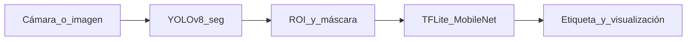

# LevelFulled

> Sistema de visión por computadora para **detección y clasificación de niveles de llenado en recipientes** (p. ej. botellas) en tiempo real o sobre imagen, con una pipeline en dos etapas: **YOLOv8 con segmentación** para localizar el objeto y enmascarar el contorno, y un **clasificador TFLite** (MobileNet entrenado a medida) sobre el recorte del frame.

La interfaz gráfica principal se presenta como **AquaSight — Level Sense AI Detector**; el script mínimo por consola muestra la ventana como **LevelWater**.

---

## Problema que resuelve

En líneas de producción o inspección, verificar manualmente el nivel de llenado de recipientes es lento, costoso y propenso a errores humanos. Este proyecto automatiza esa lectura usando cámara o archivos de imagen, **sin hardware adicional** más allá del equipo donde corre la app.

**Clases de nivel** (clasificador): vacío, medio, lleno y derramado (`modules/constants.py`).

---

## Demo

La carpeta `docs/` no está incluida en el repositorio. Si quieres ilustrar el README, crea `docs/` y añade por ejemplo `demo.gif`, `empty.jpg`, `half.jpg`, `full.jpg` (y enlázalos aquí).

---

## Arquitectura



1. **YOLOv8-seg** (`yolov8n-seg.pt`): detecta instancias; se procesan cajas cuya clase es `bottle` con confianza > 0.5.
2. **Segmentación**: si hay máscara, se usa para contorno y resaltado visual sobre una vista derivada del frame.
3. **Clasificador TFLite**: recorte del bounding box redimensionado a 224×224, normalizado; salida multiclase (`modules/classifier.py`).

### ¿Por qué dos modelos en lugar de uno?

YOLO está orientado a **detección (y máscara) robusta** en tiempo razonable. Un clasificador **ligero en TFLite** sobre el ROI permite:

- Afinar el “nivel de llenado” sin reentrenar todo el detector cada vez.
- Re-entrenar principalmente el bloque de clasificación si cambia el tipo de envase o iluminación.
- Inferencia eficiente en CPU cuando no hay GPU dedicada.

---

## Resultados

Los valores siguientes son **orientativos** / última referencia documentada en versiones anteriores del README; con cuatro clases y el stack actual (YOLOv8-seg + TFLite) conviene **volver a medir** precisión y FPS en tu máquina.

| Métrica | Valor (referencia) |
|---------|-------------------|
| Precisión clasificación (test set) | **~76%** |
| FPS promedio (CPU) | **~15 fps** |
| Clases soportadas | vacío / medio / lleno / derramado |
| Imágenes en dataset (referencia) | **~750** |

---

## Stack técnico

| Componente | Tecnología |
|------------|------------|
| Detección y segmentación | [Ultralytics YOLOv8](https://docs.ultralytics.com/) (`yolov8n-seg.pt`) |
| Clasificación de nivel | TensorFlow Lite (modelo custom, entrada 224×224) |
| Visión por computadora | OpenCV, NumPy, Pillow |
| Interfaz | CustomTkinter |
| Visualización / métricas | Matplotlib, scikit-learn |
| Entrenamiento del clasificador | TensorFlow Keras, MobileNetV2 + fine-tuning (`modelos/modelo_entrenar.py`) |
| Runtime | Python 3.10+ recomendado con TensorFlow ≥ 2.13 |

---

## Instalación

```bash
git clone https://github.com/AlexGoodD/LevelFulled
cd LevelFulled
python -m venv .venv
source .venv/bin/activate   # Windows: .venv\Scripts\activate
pip install -r requirements.txt
```

### Modelos

| Archivo | Rol |
|---------|-----|
| `yolov8n-seg.pt` | Pesos YOLO; Ultralytics puede descargarlos en la primera inferencia. El archivo suele ignorarse en git (`.gitignore`). |
| `modelos/modelo_finetuned_mobilenet.tflite` | **Ruta que usa la aplicación** (`MODELO_TFLITE_PATH` en `modules/constants.py`). Debes colocar aquí tu `.tflite` entrenado o renombrar el tuyo para coincidir con esa constante. |

**Nota sobre conversión a TFLite:** [`utils/compresion.py`](utils/compresion.py) lee `modelos/modelo_nivel_llenado.h5` y escribe `modelo_nivel_llenado.tflite`. Ese nombre **no coincide** por defecto con `modelo_finetuned_mobilenet.tflite`. Tras convertir, **renombra el archivo** o ajusta `MODELO_TFLITE_PATH` / el script para que ambos apunten al mismo fichero.

---

## Uso

**Interfaz principal (recomendado):**

```bash
python main_interface.py
```

Abre el launcher con acceso a modo tiempo real y modo procesamiento por imagen (lanza `realtime_interface.py` e `image_interface.py` en procesos separados).

**Bucle mínimo solo con OpenCV** (vista combinada original + procesada, tecla `q` para salir):

```bash
python main.py
```

> La primera ejecución puede solicitar permisos de cámara; si la ventana se cierra, vuelve a ejecutar tras aceptar el permiso.

**Otros scripts:** `interfaz.py` es una variante de UI anterior; puedes ignorarla si usas `main_interface.py`.

### Assets para la GUI

Los módulos de interfaz cargan iconos desde `assets/`. Si al clonar faltan archivos, crea la carpeta y añade al menos:

- `icon_logo.png` (barra superior)
- `realtime_icon.png`, `image_processing_icon.png` (menú principal)
- `camera_icon.png`, `ai_icon.png` (tiempo real)
- `fill_icon.png`, `check_icon.png`, `time_icon.png` (tarjetas de estadísticas)
- `chart_icon.png`, `matrix_icon.png` (modo imagen: gráficas)

Sin estos PNG la app puede fallar al resolver rutas de imágenes.

---

## Entrenar el modelo de clasificación

1. Organiza el dataset en subcarpetas por clase (misma convención que `ImageDataGenerator.flow_from_directory`).
2. Edita **`dataset_dir`** en [`modelos/modelo_entrenar.py`](modelos/modelo_entrenar.py): por defecto apunta a una ruta absoluta de ejemplo; cámbiala a tu disco antes de entrenar.
3. Ejecuta el entrenamiento (genera el modelo Keras según el script).
4. Convierte a TFLite con cuantización por defecto:

```bash
python utils/compresion.py
```

5. Coloca o renombra el `.tflite` resultante para que coincida con `MODELO_TFLITE_PATH` en `modules/constants.py`, o actualiza esa constante.

---

## Estructura del proyecto

```
LevelFulled/
├── main.py                    # OpenCV: cámara + pipeline (vista combinada)
├── main_interface.py          # Launcher CustomTkinter (AquaSight)
├── realtime_interface.py      # UI tiempo real + cámara
├── image_interface.py         # UI carga de imagen + gráficas
├── interfaz.py                # UI alternativa / legado
├── modules/
│   ├── constants.py           # Rutas de modelos y clases
│   ├── models.py              # Carga TFLite + YOLO
│   ├── detector.py            # YOLO + máscara + orquestación
│   ├── classifier.py          # Inferencia TFLite sobre ROI
│   ├── camera_utils.py        # Selección de cámara
│   └── ui/                    # Componentes CustomTkinter
├── modelos/
│   ├── modelo_entrenar.py     # Entrenamiento Keras (MobileNetV2)
│   └── …                      # .pt YOLO, .tflite, .h5 según tu flujo
├── utils/
│   ├── compresion.py          # Keras .h5 → TFLite
│   ├── imagenes.py
│   └── flat.py
├── assets/                    # Iconos para la GUI (ver arriba)
└── requirements.txt
```

---

## Referencias

- [Ultralytics YOLOv8](https://docs.ultralytics.com/models/yolov8/)
- [TensorFlow Lite — optimización de modelos](https://www.tensorflow.org/lite/performance/model_optimization)
- [OpenCV](https://docs.opencv.org/4.x/d2/d64/tutorial_table_of_content_objdetect.html)

---

## Autor

**Alex** — [@AlexGoodD](https://github.com/AlexGoodD)
